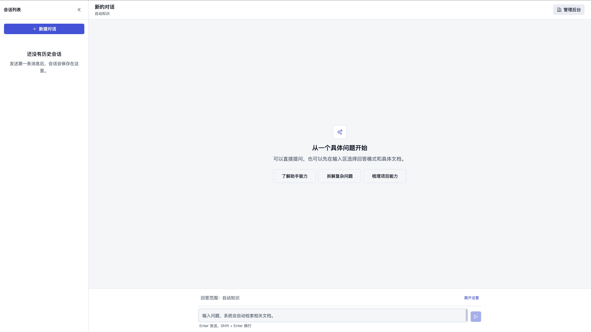
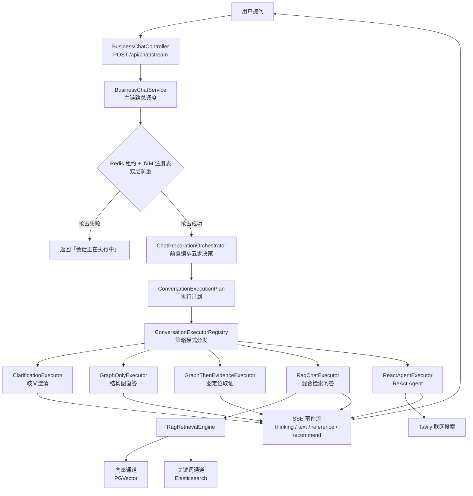
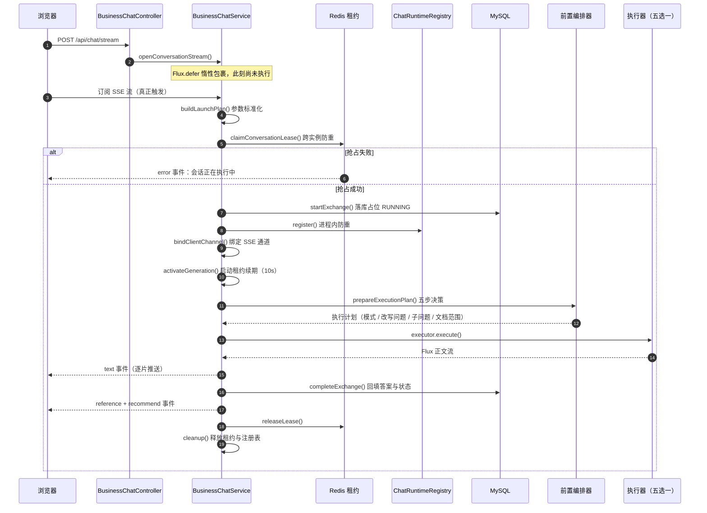
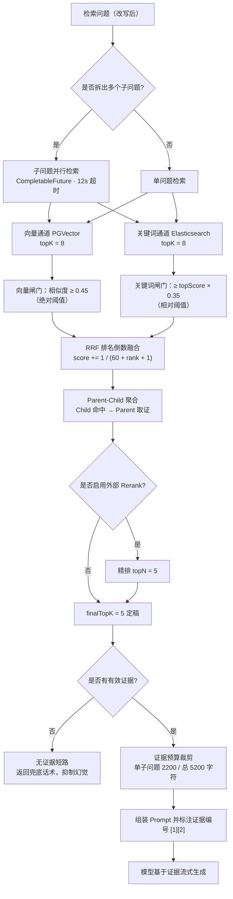
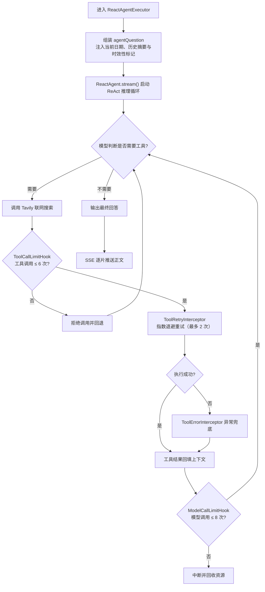
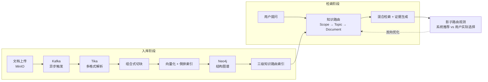
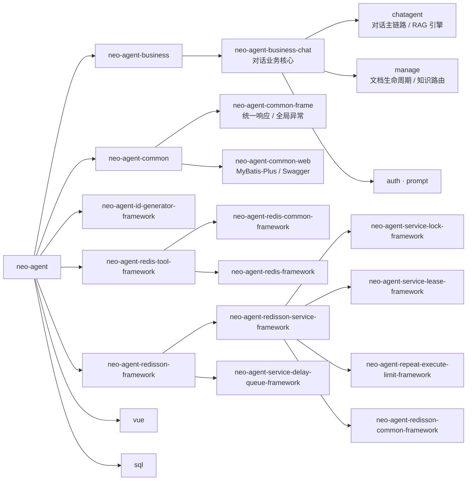

<p align="center">
  <strong>企业级多编排 AI 智能体平台</strong><br />
  <span>文档知识问答 · 混合检索 · ReAct 工具调用 · 全链路可观测</span>
</p>

<p align="center">
  <a href="./LICENSE"></a>
  
  
  
  
  
  
  
  
</p>

# Neo Agent

**Neo Agent** 是一个企业级 AI 智能体对话平台，覆盖文档知识治理、知识路由、混合检索、证据驱动生成、ReAct 工具调用与全链路可观测的完整闭环。

核心设计思想是 **「确定性编排 + 场景化执行」**：先用确定性的编排逻辑做好决策，再把执行交给最合适的引擎 —— 而不是把所有问题都丢给 Agent。



---

## 功能特性

| 能力 | 说明 |
| :--- | :--- |
| **多编排执行** | 前置编排器五步决策链，按场景分流到五种执行器；新增模式只需加一个实现类 |
| **Agentic RAG** | 问题改写 → 子问题拆分 → 双通道检索 → RRF 融合 → 父子块聚合 → 证据预算 → 引用可追溯 |
| **知识路由** | 三级漏斗（Scope → Topic → Document）自动锁定文档；置信度不足时主动澄清而非硬猜 |
| **结构图导航** | Neo4j 构建 `Document → Section → Item` 层级图谱，支持章节定位、邻接遍历、编号项取证 |
| **ReAct Agent** | 联网搜索 + 工具调用 + Checkpoint 持久化，带模型 / 工具调用次数护栏与重试兜底 |
| **文档治理** | Tika 多格式解析 → 组合式切块（结构 / 递归 / 语义 / LLM）→ 向量 + 倒排双引擎索引，Kafka 异步流水线 |
| **会话记忆** | 无记忆 / 滑动窗口 / 摘要压缩三种策略，增量摘要保证单次成本恒定 |
| **流式输出** | SSE 六类事件：思考进度 / 正文分片 / 引用来源 / 推荐追问 / 状态 / 错误 |
| **可观测** | 全链路 Trace：阶段耗时、检索通道命中、证据来源、模型用量与成本 |
| **集群安全** | Redis 租约 + JVM 注册表双层防重，租约自动续期，收尾统一释放不留孤儿锁 |

---

## 架构设计

### 整体架构



### 对话执行链路



### 五种执行器

判断顺序：**歧义澄清 > 知识问答 > 开放式 Agent**，优先用最稳定的方式回答。

| 执行模式 | 触发条件 | 处理方式 |
| :--- | :--- | :--- |
| `CLARIFICATION` | 文档范围或意图存在歧义 | 返回澄清问题与候选，引导用户补充 |
| `GRAPH_ONLY` | 纯结构关系（"上一节""包含哪些章节"） | 只查 Neo4j，不调用大模型 |
| `GRAPH_THEN_EVIDENCE` | 编号项定位（"第几步""第几项"） | 图定位章节后读取条目证据 |
| `RETRIEVAL` | 常规知识问答 | 双通道混合检索 + 证据驱动生成 |
| `REACT_AGENT` | 需联网搜索 / 多步推理的开放问题 | ReAct 循环，自主决策与工具调用 |

### RAG 检索链路



### ReAct Agent 执行流程



### 文档知识闭环



组合式切块引擎的四种策略各司其职：

| 策略 | 角色 | 使用场景 |
| :--- | :--- | :--- |
| 结构切块 | 主干 | 按标题 / 章节 / 段落切成语义完整的块 |
| 递归分块 | 兜底 | 结构块过大时继续裁剪，控制块大小 |
| 语义分块 | 优化 | 在结构切块基础上做边界精修 |
| LLM 切块 | 增强 | 处理低质量或复杂文档，默认关闭 |

### 模块结构



---

## 技术栈

| 类别 | 技术 |
| :--- | :--- |
| 基础框架 | JDK 17 · Spring Boot 3.5.6 · Spring AI 1.1.0 · Spring AI Alibaba 1.1.2.0 |
| 业务存储 | MySQL · MyBatis-Plus |
| 检索存储 | PostgreSQL + PGVector（向量）· Elasticsearch（关键词 / 倒排） |
| 图存储 | Neo4j（文档结构图谱 + 知识路由） |
| 缓存与协调 | Redis · Redisson |
| 消息与对象存储 | Kafka · MinIO |
| 文档解析 | Apache Tika 3.2.3 |
| 模型服务 | 阿里云百炼 DashScope（对话 + Embedding）· Tavily（联网搜索）· SiliconFlow（Rerank，可选） |
| 前端 | Vue 3 · Vite · Tailwind CSS · shadcn-vue · Cytoscape |
| 工具链 | Reactor · Knife4j · Lombok · Hutool · JWT · Log4j2 |

---

## 快速开始

### 环境要求

| 依赖 | 版本 | 默认端口 |
| :--- | :--- | :--- |
| JDK | 17+ | — |
| Maven | 3.8+ | — |
| Node.js | 18+ | — |
| MySQL | 8.x | 3307 |
| PostgreSQL + PGVector | 16 / 0.7+ | 5432 |
| Elasticsearch | 8.x（建议装 IK 分词插件） | 9200 |
| Neo4j | 5.x | 7687 |
| Redis | 7.x | 6379 |
| Kafka | 3.x | 9092 |
| MinIO | 最新版 | 9000 |

> 端口与地址均可在 `neo-agent-business/neo-agent-business-chat/src/main/resources/application.yaml` 中调整。

### 1. 初始化数据库

MySQL：

```bash
mysql -h127.0.0.1 -P3307 -uroot -p < sql/Mysql/create_database_mysql.sql
mysql -h127.0.0.1 -P3307 -uroot -p < sql/Mysql/create_table_mysql.sql
```

PostgreSQL（PGVector）：

```bash
psql -h127.0.0.1 -p5432 -U postgres -f sql/PostgresSql/create_database_postgres_sql.sql
psql -h127.0.0.1 -p5432 -U postgres -d neo_agent_pgvector -f sql/PostgresSql/create_table_postgres_sql.sql
```

Elasticsearch 索引与 Neo4j 图谱由应用启动时自动创建，无需手动初始化。

### 2. 配置密钥

配置文件中的敏感项均通过环境变量注入，启动前需设置：

```bash
# 必填：阿里云百炼（对话 + Embedding）
export ALI_BAI_LIAN_API_KEY=sk-xxxxxxxx

# 必填：Tavily 联网搜索
export TAVILY_API_KEY=tvly-xxxxxxxx

# 中间件密码（按本机实际配置，不设置则使用默认值）
export MYSQL_PASSWORD=root
export POSTGRES_PASSWORD=postgres
export ELASTICSEARCH_PASSWORD=elastic
export NEO4J_PASSWORD=12345678
export REDIS_PASSWORD=

# 管理后台账号（默认 admin / admin123456）
export NEO_AGENT_ADMIN_USERNAME=admin
export NEO_AGENT_ADMIN_PASSWORD=admin123456

# 可选：外部 Rerank 精排
export RERANK_API_KEY=sk-xxxxxxxx
```

### 3. 启动后端

```bash
# 安装各依赖模块到本地仓库
mvn clean install -DskipTests

# 启动对话业务服务（端口 9082）
mvn -pl neo-agent-business/neo-agent-business-chat spring-boot:run
```

也可以打包后运行：

```bash
java -jar neo-agent-business/neo-agent-business-chat/target/neo-agent-business-chat-0.0.1-SNAPSHOT.jar
```

接口文档（Knife4j）：<http://localhost:9082/doc.html>

### 4. 启动前端

```bash
cd vue
npm install
npm run dev
```

前端开发服务器为 `5173` 端口，已配置 `/api`、`/admin/auth`、`/manage` 到后端 `9082` 的代理；如需指向其他后端地址，设置 `VITE_PROXY_TARGET`。

### 5. 访问地址

| 入口 | 地址 |
| :--- | :--- |
| 对话工作台 | <http://localhost:5173/chat> |
| 管理后台 | <http://localhost:5173/admin/login> |
| 后端接口文档 | <http://localhost:9082/doc.html> |

### 6. 首次使用

1. 登录管理后台 → **知识路由**，创建知识域（Scope）与主题（Topic）
2. → **文档管理**，上传文档并配置知识域、业务分类与标签
3. 等待 Kafka 异步流水线完成解析 → 查看系统推荐的切块策略 → 确认后构建索引
4. 回到**对话工作台**提问，即可看到检索证据、引用来源与推荐追问

---

## 项目结构

```
neo-agent/
├── neo-agent-business/
│   └── neo-agent-business-chat/          # 对话业务核心
│       └── src/main/java/com/sopengin/neo/ai/
│           ├── chatagent/
│           │   ├── controller/           # 入口 BusinessChatController
│           │   ├── service/              # BusinessChatService 主链路调度
│           │   ├── rag/                  # RAG 引擎
│           │   │   ├── executor/         # 五种执行器
│           │   │   ├── retrieve/channel/ # 双通道检索
│           │   │   └── service/          # 编排、检索、Prompt 组装
│           │   ├── tool/                 # Tavily 联网搜索
│           │   └── support/              # SSE 事件输出
│           ├── manage/                   # 文档生命周期 + 知识路由
│           ├── auth/                     # 管理后台鉴权
│           └── prompt/                   # Prompt 模板加载
├── neo-agent-common/                     # 通用能力（frame / web）
├── neo-agent-redisson-framework/         # 分布式锁、租约、延迟队列
├── neo-agent-redis-tool-framework/       # Redis 工具封装
├── neo-agent-id-generator-framework/     # 分布式 ID 生成
├── vue/                                  # 前端（Vue 3 + Vite）
├── sql/                                  # 建表脚本（MySQL / PostgresSql）
├── samples/                              # 知识库样例文档
└── docs/                                 # 架构文档与界面截图
```

架构细节见 [`docs/architecture/`](docs/architecture/README.md)。

---

## License

[Apache License 2.0](LICENSE)
